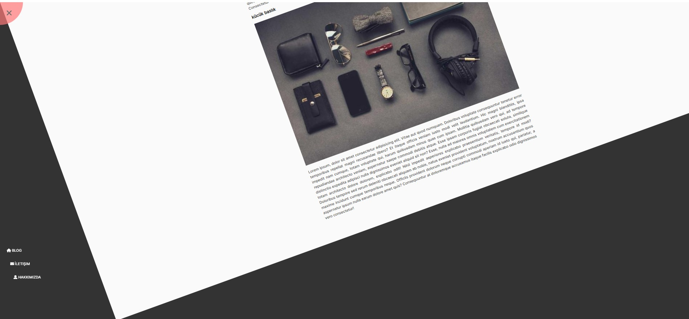

# Circle Navigation 

This project is a simple example of HTML, CSS, and JavaScript that enables opening and closing navigation within a circle.

[Live Demo](https://youtube-al-ma-3.vercel.app/)

## Features

- Allows toggling of navigation open/close with menu buttons inside a circle.
- Applies an animation effect by rotating the main content section when the menu is opened.
- Displays menu items as a neatly arranged navigation menu at the bottom.

## Usage

1. Open the `index.html` file in your web browser.
2. Click on the menu buttons inside the circle to open or close the navigation menu.

## Files

- `index.html`: Main HTML file defining the page structure and content.
- `style.css`: CSS file managing the appearance and style of the page.
- `app.js`: JavaScript file controlling the opening/closing of the menu.

## Additional Information

- The project utilizes the Font Awesome library for icons.
- Google Fonts API provides the font for text on the page.

## License

This project is licensed under the MIT License. See the [LICENSE file](LICENSE) for more information.
